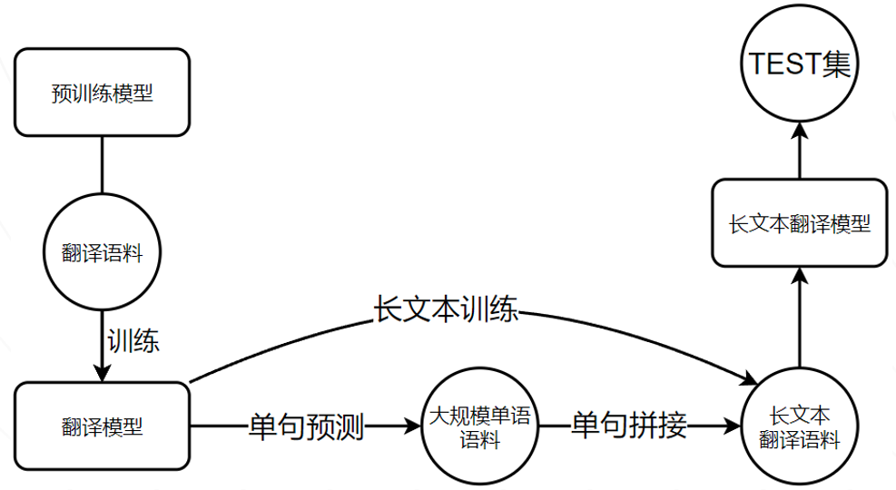

<h3 align="center">Towards Better Chinese-centric Neural Machine Translation for
Low-resource Languages
</h3>


<hr>
<h4 align="center">
    <p>
        <b>English</b> |
        <a href="https://github.com/WENGSYX/Low-resource-text-translation/blob/main/readme_zh.md">简体中文</a>
    <p>
</h4>


<h3 align="center">
    <p>State-of-the-art of IFKEAI</p>
</h3>


#####             The last decade has witnessed enormous improvements in science and technology, which has stimulated the growing demand for economic and cultural exchanges in various countries. Building a neural machine translation (NMT) system has become an urgent trend, especially in the low-resource setting. However, recent works tend to study the NMT system of the low-resource languages centered on English, while few works concentrate on the low-resource NMT centered on Chinese. To achieve this, the low-resource multilingual translation challenge of the 2021 iFLYTEK AI Developer Competition provides the Chinese-centric multilingual low-resource NMT tasks, where participants are required to build NMT systems based on the provided low-resource samples. In this paper, we present the winner competition system that leverages monolingual word embeddings data enhancement, bilingual curriculum learning, and contrastive re-ranking. In addition, a new Incomplete-Trust (In-trust) loss function is proposed to replace the traditional cross-entropy loss when training. The experimental results demonstrate that the implementation of these ideas leads better performance than other state-of-the-art methods. 


## Data analysis


#### Malay

Malay is a Malay Polynesian language family belonging to the South Island language family in language classification. It is mainly used in Malaysia, Singapore and some parts of Brunei.

###### Sebaiknya, awak semua berehat.


#### Indonesian

Bahasa Indonesia (Bahasa Indonesia), the Indonesian Malay Liao Nei dialect, is the official language of Indonesia. It belongs to the Malay Polynesian language family and is one of the most widely used languages in the world.

###### Wah, keberuntungan tersembunyi.


##### In fact, these two language families belong to the Malay Polynesian language family of the South Island language family, and their relationship is equivalent to American English and British English. Therefore, we can almost think that these two language families can be trained at the same time




## Anti noise learning

We find that the translation effect of the model will be reduced when training directly with small language data sets, or even bilingual data at the same time. We speculate that the small-scale and poor translation of small language training sets may lead to excessive noise during training and interfere with the model.


Therefore, we use the incomplete trust loss function (in trust) of acl2021 paper * * named entity recognition via noise aware training mechanism with data filter * *.


In the M2M model training stage, the model learns a large amount of data, so the output of the model is relatively correct. However, because the training set label cannot be guaranteed to be completely correct, the label is incomplete and correct. We choose to trust both label information and model output to form an in trust loss function. The calculation formula is as follows:


```
class In_trust_Loss(nn.Module):
    def __init__(self, alpha=1, beta=0.8,delta=0.5, num_classes=35):
        super().__init__()
        self.alpha = alpha
        self.beta = beta
        self.num_classes = num_classes
        self.delta = delta
        self.cross_entropy = torch.nn.CrossEntropyLoss()
        #self.crf = CRF(num_tags= num_classes, batch_first=True)
    def forward(self, logits,labels):

        #loss_mask = labels.gt(0)
        #Loss CRF
        ce = self.cross_entropy(logits,labels)
        #Loss In_trust
        active_logits = logits.view(-1,self.num_classes)
        active_labels = labels.view(-1)

        pred = F.softmax(active_logits, dim=1)
        pred = torch.clamp(pred, min=1e-7, max=1.0)
        label_one_hot = torch.nn.functional.one_hot(active_labels,self.num_classes).float()
        label_one_hot = torch.clamp(label_one_hot, min=1e-4, max=1.0)
        dce = (-1*torch.sum(pred * torch.log(pred*self.delta + label_one_hot*(1-self.delta)), dim=1))

        # Loss

        loss = self.alpha * ce - self.beta * dce.mean()
        return loss
```

###### The DCE term is an acceleration adjustment term, P refers to the output information of the model, and Q refers to the label information; α、β and δ Are three super parameters. The loss function uses both label information and model output to form a robust DCE term. The DCE term and the traditional conditional random field CRF form a loss function in trust, which can effectively alleviate the over fitting noise samples of the model.

##### Compared with the model trained directly in the training set, the Bleu index of the average translation result can be improved by 1.5%


## Cite

```
@article{li2022towards,
  title={Towards Better Chinese-centric Neural Machine Translation for Low-resource Languages},
  author={Li, Bin and Weng, Yixuan and Xia, Fei and Deng, Hanjun},
  journal={arXiv preprint arXiv:2204.04344},
  year={2022}
}
```
