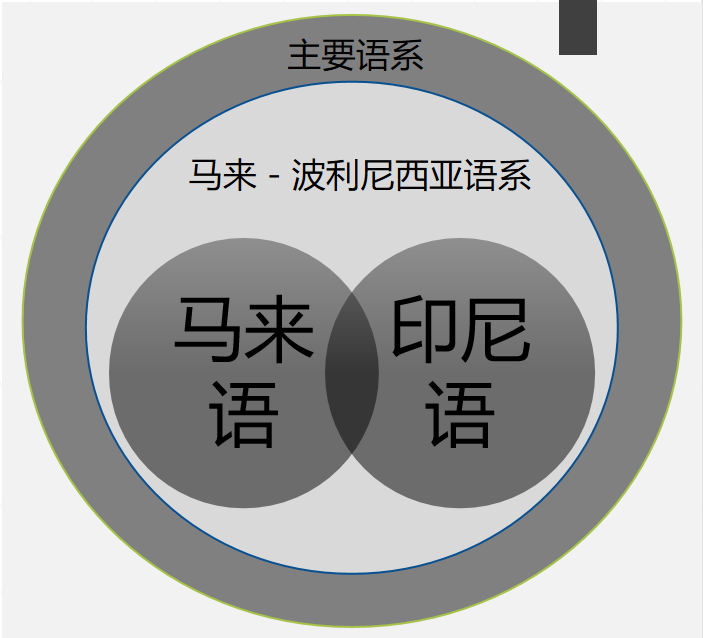
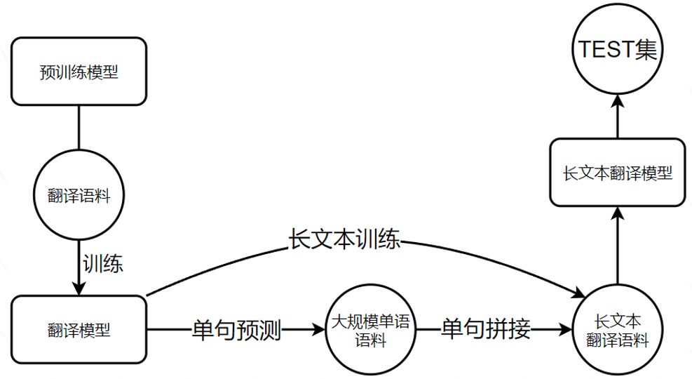
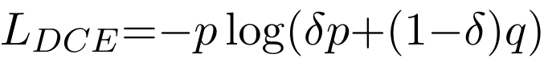
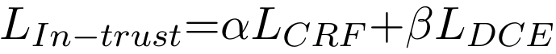

# 基于迁移学习与抗噪学习的小语种翻译模型 

#### 科大讯飞 2021 低资源多语种文本翻译挑战赛获奖方案
#### 我们使用神经网络机器翻译技术，在小语种训练集上训练模型，达到了SOTA.其中使用了两大核心技术，一个是课程学习，另一个则是抗噪学习


## 数据分析

#### 马来语

马来语，在语言分类上属于南岛语系的马来-波利尼西亚语族，主要使用于马来西亚、新加坡以及文莱的部分地区等。

Sebaiknya, awak semua berehat.


#### 印尼语

印度尼西亚语（印尼语：Bahasa Indonesia），即印尼化的马来语廖内方言，是印度尼西亚的官方语言，属马来-波利尼西亚语族，是世界上使用最广泛的语言之一。

Wah, keberuntungan tersembunyi.



#### 实际上，这两种语系都属于南岛语系中的马来－波利尼西亚语系，其关系相当于是美式英语与英式英语，因此我们可以近乎认为，这两种语系可以同时训练


## 课程学习

       #### 我们使用课程学习式训练

1.        #### 同时使用两种语言训练

2. #### 单语种训练

3. #### 使用单语种训练的模型，对单语语料进行逐句翻译，之后拼接为 长文本

4. #### 在回译的长文本中进行训练

5. #### 对较长文本测试集进行预测




## 抗噪学习

​       我们发现，直接用小语种数据集进行训练，甚至双语数据同时训练，模型的翻译效果将会降低，我们推测，可能是因为小语种训练集规模小、翻译差等原因，导致训练时噪声过大，干扰模型。

​      因此我们使用ACL2021论文**Named Entity Recognition via Noise Aware Training Mechanism with Data Filter**的不完全信任损失函数（In-trust）。

​       在M2M模型训练阶段，模型学习了大量的数据，因此模型的输出具有相对正确性，但由于训练集标签不能保证完全正确，因此标签具有不完整正确性。我们选择同时信任标签信息和模型输出，构成了In-trust损失函数，计算公式如下：





代码如下：

```
class In_trust_Loss(nn.Module):
    def __init__(self, alpha=1, beta=0.8,delta=0.5, num_classes=35):
        super().__init__()
        self.alpha = alpha
        self.beta = beta
        self.num_classes = num_classes
        self.delta = delta
        self.cross_entropy = torch.nn.CrossEntropyLoss()
        #self.crf = CRF(num_tags= num_classes, batch_first=True)
    def forward(self, logits,labels):

        #loss_mask = labels.gt(0)
        #Loss CRF
        ce = self.cross_entropy(logits,labels)
        #Loss In_trust
        active_logits = logits.view(-1,self.num_classes)
        active_labels = labels.view(-1)

        pred = F.softmax(active_logits, dim=1)
        pred = torch.clamp(pred, min=1e-7, max=1.0)
        label_one_hot = torch.nn.functional.one_hot(active_labels,self.num_classes).float()
        label_one_hot = torch.clamp(label_one_hot, min=1e-4, max=1.0)
        dce = (-1*torch.sum(pred * torch.log(pred*self.delta + label_one_hot*(1-self.delta)), dim=1))

        # Loss

        loss = self.alpha * ce - self.beta * dce.mean()
        return loss
```

​      其中DCE项是一个加速度调节项，p指模型的输出信息，q为标签信息；α、β和δ是三个超参数。该损失函数同时利用了标签信息与模型输出，组成了具有鲁棒性的DCE项。DCE项与传统的条件随机场CRF共同组成损失函数In-trust，可以有效缓解模型过拟合噪声样本。

​      相比于模型直接在训练集中训练，平均翻译结果BLEU指标能够提升1.5%.


## 复现代码

首先进入code文件夹

### 训练 

###### 复现所需代码库

```
pandas
torch
transformers
sacrebleu
sklearn
tqdm
numpy
json
```


###### 读取数据

将原数据进行转换，并对其中的特殊字符转换为正常格式

`python read_train.py`

`python read_test.py`

`python read_dev.py`

###### 训练模型

请根据需要，对main.py文件中CFG的'sen1'和'sen2‘进行修改，将'sen1'设置为源语言,'sen2'设置为目标语言

`python main.py`


### 预测

#### 模型下载

```
因为模型过大，邮箱无法发送，因此我们上传到了网盘，请前往下载

*https://www.aliyundrive.com/s/8nZDe4ohhsG*

将zhid.jpg和zhms.jpg修改后缀名为zhid.pt和zhms.pt
```

```
链接：https://pan.baidu.com/s/1l_eH00sK9EjZLqxGeH15rA 
提取码：8888
将下载idzh.zip和mszh.zip后解压为文件夹
```


##### zh-id

```
wget https://dl.fbaipublicfiles.com/m2m_100/spm.128k.model
wget https://dl.fbaipublicfiles.com/m2m_100/data_dict.128k.txt
wget https://dl.fbaipublicfiles.com/m2m_100/model_dict.128k.txt
wget https://dl.fbaipublicfiles.com/m2m_100/language_pairs.txt

python fairseq-master/scripts/spm_encode.py --model spm.128k.model --output_format=piece  --inputs=id_zh.txt  --outputs=spm.id-zh.id

python fairseq-master/scripts/spm_encode.py --model spm.128k.model --output_format=piece  --inputs=zh_id.txt  --outputs=spm.id-zh.zh

fairseq-preprocess --source-lang id --target-lang zh --testpref spm.id-zh --thresholdsrc 0 --thresholdtgt 0 --destdir zh_id_data_bin --srcdict data_dict.128k.txt --tgtdict data_dict.128k.txt

fairseq-generate zh_id_data_bin --batch-size 28 --path zhid.pt --fixed-dictionary model_dict.128k.txt -s zh -t id --remove-bpe 'sentencepiece'  --criterion label_smoothed_cross_entropy_with_alignment --beam 5 --task translation_multi_simple_epoch --lang-pairs language_pairs.txt  --decoder-langtok --encoder-langtok src  --gen-subset test  --fp16 --dataset-impl mmap --distributed-world-size 1 --distributed-no-spawn --pipeline-model-parallel  --pipeline-chunks 1 --pipeline-encoder-balance '[1,15,10]'  --pipeline-encoder-devices '[0,1,0]'  --pipeline-decoder-balance '[3,11,11,1]' --pipeline-decoder-devices '[0,2,3,0]' > zh_id_gen_out

```

##### zh-ms

```
wget https://dl.fbaipublicfiles.com/m2m_100/spm.128k.model
wget https://dl.fbaipublicfiles.com/m2m_100/data_dict.128k.txt
wget https://dl.fbaipublicfiles.com/m2m_100/model_dict.128k.txt
wget https://dl.fbaipublicfiles.com/m2m_100/language_pairs.txt

python fairseq-master/scripts/spm_encode.py --model spm.128k.model --output_format=piece  --inputs=ms_zh.txt  --outputs=spm.ms-zh.ms

python fairseq-master/scripts/spm_encode.py --model spm.128k.model --output_format=piece  --inputs=zh_ms.txt  --outputs=spm.ms-zh.zh

fairseq-preprocess --source-lang ms --target-lang zh --testpref spm.ms-zh --thresholdsrc 0 --thresholdtgt 0 --destdir zh_ms_data_bin --srcdict data_dict.128k.txt --tgtdict data_dict.128k.txt

fairseq-generate zh_ms_data_bin --batch-size 28 --path zhms.pt --fixed-dictionary model_dict.128k.txt -s zh -t id --remove-bpe 'sentencepiece'  --criterion label_smoothed_cross_entropy_with_alignment --beam 5 --task translation_multi_simple_epoch --lang-pairs language_pairs.txt  --decoder-langtok --encoder-langtok src  --gen-subset test  --fp16 --dataset-impl mmap --distributed-world-size 1 --distributed-no-spawn --pipeline-model-parallel  --pipeline-chunks 1 --pipeline-encoder-balance '[1,15,10]'  --pipeline-encoder-devices '[0,1,0]'  --pipeline-decoder-balance '[3,11,11,1]' --pipeline-decoder-devices '[0,2,3,0]' > zh_ms_gen_out

```


##### ms-zh

```
python test_mszh.py
```


##### id-zh

```
python test_idzh.py
```


